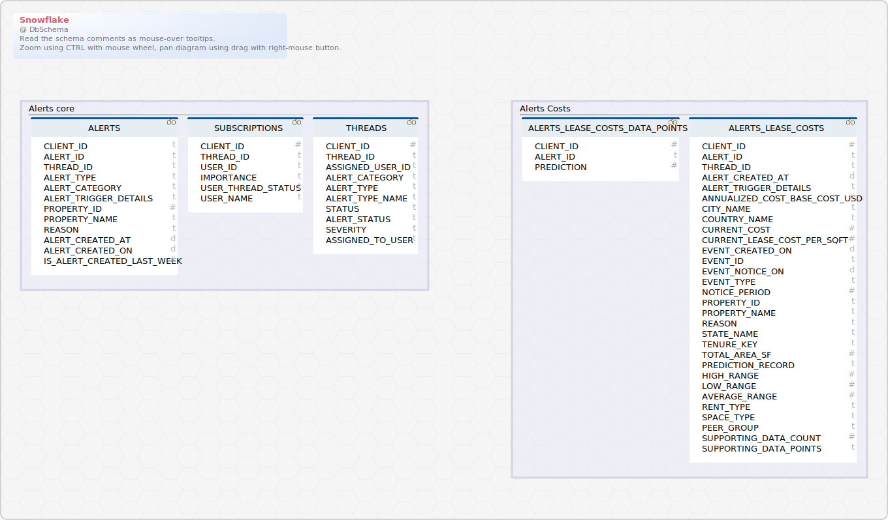

<a name='layout1'>### ALR

## View <a name='ALERTS'>ALERTS</a>

Query ALERTS
CREATE OR REPLACE SECURE VIEW &#36;&#123;name&#125;
AS
 SELECT
  A&#46;CLIENT&#95;ID&#44;
  A&#46;ALERT&#95;ID&#44;
  T&#46;THREAD&#95;ID&#44;
  TY&#46;ALERT&#95;TYPE&#44;
  C&#46;ALERT&#95;CATEGORY&#44;
  A&#46;ALERT&#95;TRIGGER&#95;DETAILS&#44;  
  TRY&#95;CAST&#40;A&#46;ALERT&#95;TRIGGER&#95;DETAILS&#58;property&#95;id&#58;&#58;STRING AS NUMBER&#40;38&#44;0&#41;&#41; PROPERTY&#95;ID&#44;
  A&#46;ALERT&#95;TRIGGER&#95;DETAILS&#58;property&#95;name&#58;&#58;string PROPERTY&#95;NAME&#44;
  A&#46;ALERT&#95;TRIGGER&#95;DETAILS&#58;reason&#58;&#58;string REASON&#44;
  A&#46;ALERT&#95;CREATED&#95;AT&#44;
  DATE&#95;TRUNC&#40;DAY&#44; A&#46;ALERT&#95;CREATED&#95;AT&#41; ALERT&#95;CREATED&#95;ON&#44;
  IFF&#40;DATEDIFF&#40;DAY&#44; A&#46;ALERT&#95;CREATED&#95;AT&#44; CURRENT&#95;DATE&#40;&#41;&#41;&lt;&#61;6&#44;1&#44;0&#41; IS&#95;ALERT&#95;CREATED&#95;LAST&#95;WEEK
 FROM AZARA&#46;APP&#46;&#36;&#123;name&#125; A
    LEFT JOIN AZARA&#46;APP&#46;THREADS T ON A&#46;THREAD&#95;ID&#61;T&#46;THREAD&#95;ID AND A&#46;CLIENT&#95;ID&#61;T&#46;CLIENT&#95;ID
    LEFT JOIN AZARA&#46;APP&#46;ALERT&#95;CATEGORIES C ON T&#46;ALERT&#95;CATEGORY&#95;ID&#61;C&#46;ALERT&#95;CATEGORY&#95;ID
    LEFT JOIN AZARA&#46;APP&#46;ALERT&#95;TYPES TY ON T&#46;ALERT&#95;TYPE&#95;ID&#61;TY&#46;ALERT&#95;TYPE&#95;ID
 WHERE
  A&#46;CLIENT&#95;ID &#61; 7642269

| Idx | Field Name | Data Type |
|---|---|---|
|  | <a name='ALR.ALERTS_CLIENT_ID'>CLIENT&#95;ID</a>| varchar  |
|  | <a name='ALR.ALERTS_ALERT_ID'>ALERT&#95;ID</a>| varchar  |
|  | <a name='ALR.ALERTS_THREAD_ID'>THREAD&#95;ID</a>| varchar  |
|  | <a name='ALR.ALERTS_ALERT_TYPE'>ALERT&#95;TYPE</a>| varchar  |
|  | <a name='ALR.ALERTS_ALERT_CATEGORY'>ALERT&#95;CATEGORY</a>| varchar  |
|  | <a name='ALR.ALERTS_ALERT_TRIGGER_DETAILS'>ALERT&#95;TRIGGER&#95;DETAILS</a>| variant  |
|  | <a name='ALR.ALERTS_PROPERTY_ID'>PROPERTY&#95;ID</a>| number  |
|  | <a name='ALR.ALERTS_PROPERTY_NAME'>PROPERTY&#95;NAME</a>| varchar  |
|  | <a name='ALR.ALERTS_REASON'>REASON</a>| varchar  |
|  | <a name='ALR.ALERTS_ALERT_CREATED_AT'>ALERT&#95;CREATED&#95;AT</a>| timestamp&#95;ntz  |
|  | <a name='ALR.ALERTS_ALERT_CREATED_ON'>ALERT&#95;CREATED&#95;ON</a>| timestamp&#95;ntz  |
|  | <a name='ALR.ALERTS_IS_ALERT_CREATED_LAST_WEEK'>IS&#95;ALERT&#95;CREATED&#95;LAST&#95;WEEK</a>| number  |

## View <a name='ALERTS_LEASE_COSTS'>ALERTS_LEASE_COSTS</a>

Query ALERTS_LEASE_COSTS
CREATE OR REPLACE SECURE VIEW &#36;&#123;name&#125;
 AS
SELECT 
  a&#46;client&#95;id&#58;&#58;number client&#95;id&#44;
  a&#46;alert&#95;id&#44;
  a&#46;thread&#95;id&#44;
  a&#46;alert&#95;created&#95;at&#44;
  ALERT&#95;TRIGGER&#95;DETAILS&#44;
  ALERT&#95;TRIGGER&#95;DETAILS&#58;annualized&#95;cost&#95;base&#95;cost&#95;usd&#58;&#58;float annualized&#95;cost&#95;base&#95;cost&#95;usd&#44;
  ALERT&#95;TRIGGER&#95;DETAILS&#58;city&#95;name&#58;&#58;string city&#95;name&#44;
  ALERT&#95;TRIGGER&#95;DETAILS&#58;country&#95;name&#58;&#58;string country&#95;name&#44;
  ALERT&#95;TRIGGER&#95;DETAILS&#58;current&#95;cost&#58;&#58;float current&#95;cost&#44;
  ALERT&#95;TRIGGER&#95;DETAILS&#58;base&#95;rent&#58;&#58;float current&#95;lease&#95;cost&#95;per&#95;sqft&#44;
  to&#95;date&#40;to&#95;timestamp&#40;TRY&#95;CAST&#40;ALERT&#95;TRIGGER&#95;DETAILS&#58;event&#95;created&#95;on&#58;&#58;string as number&#41;&#44; 3&#41;&#41; event&#95;created&#95;on&#44;
  ALERT&#95;TRIGGER&#95;DETAILS&#58;event&#95;id&#58;&#58;string event&#95;id&#44;
  to&#95;date&#40;to&#95;timestamp&#40;TRY&#95;CAST&#40;ALERT&#95;TRIGGER&#95;DETAILS&#58;event&#95;notice&#95;on&#58;&#58;string as number&#41;&#44; 3&#41;&#41; event&#95;notice&#95;on&#44;
  ALERT&#95;TRIGGER&#95;DETAILS&#58;event&#95;type&#58;&#58;string event&#95;type&#44;
  ALERT&#95;TRIGGER&#95;DETAILS&#58;notice&#95;period&#58;&#58;float notice&#95;period&#44;
  ALERT&#95;TRIGGER&#95;DETAILS&#58;property&#95;id&#58;&#58;string property&#95;id&#44;
  ALERT&#95;TRIGGER&#95;DETAILS&#58;property&#95;name&#58;&#58;string property&#95;name&#44;
  ALERT&#95;TRIGGER&#95;DETAILS&#58;reason&#58;&#58;string reason&#44;
  ALERT&#95;TRIGGER&#95;DETAILS&#58;state&#95;name&#58;&#58;string state&#95;name&#44;
  ALERT&#95;TRIGGER&#95;DETAILS&#58;tenure&#95;key&#58;&#58;string tenure&#95;key&#44;
  TRY&#95;CAST&#40;ALERT&#95;TRIGGER&#95;DETAILS&#58;tenure&#95;size&#58;&#58;string as float&#41; total&#95;area&#95;sf&#44;
  ALERT&#95;TRIGGER&#95;DETAILS&#58;prediction&#95;record&#58;&#58;variant prediction&#95;record&#44;
  prediction&#95;record&#58;high&#95;range&#58;&#58;float high&#95;range&#44;
  prediction&#95;record&#58;low&#95;range&#58;&#58;float low&#95;range&#44;
  &#40;high&#95;range&#43;low&#95;range&#41; &#47; 2 average&#95;range&#44;
  prediction&#95;record&#58;rent&#95;type&#58;&#58;string rent&#95;type&#44;
  prediction&#95;record&#58;space&#95;type&#58;&#58;string space&#95;type&#44;
  rent&#95;type &#124;&#124; &#39; &#45; &#39; &#124;&#124; space&#95;type peer&#95;group&#44;
  prediction&#95;record&#58;supporting&#95;data&#95;count&#58;&#58;number supporting&#95;data&#95;count&#44;
  prediction&#95;record&#58;supporting&#95;data&#95;points&#58;&#58;variant supporting&#95;data&#95;points
 FROM ALR&#46;ALERTS a
 WHERE a&#46;ALERT&#95;TYPE&#61;&#39;market&#95;benchmark&#39; and a&#46;CLIENT&#95;ID &#61; 7642269
 QUALIFY&#40;row&#95;number&#40;&#41; over&#40;partition by a&#46;client&#95;id&#44; property&#95;id&#44; event&#95;id&#44; tenure&#95;key order by ALERT&#95;CREATED&#95;AT DESC&#41;&#41;&#61;1

| Idx | Field Name | Data Type |
|---|---|---|
|  | <a name='ALR.ALERTS_LEASE_COSTS_CLIENT_ID'>CLIENT&#95;ID</a>| number  |
|  | <a name='ALR.ALERTS_LEASE_COSTS_ALERT_ID'>ALERT&#95;ID</a>| varchar  |
|  | <a name='ALR.ALERTS_LEASE_COSTS_THREAD_ID'>THREAD&#95;ID</a>| varchar  |
|  | <a name='ALR.ALERTS_LEASE_COSTS_ALERT_CREATED_AT'>ALERT&#95;CREATED&#95;AT</a>| timestamp&#95;ntz  |
|  | <a name='ALR.ALERTS_LEASE_COSTS_ALERT_TRIGGER_DETAILS'>ALERT&#95;TRIGGER&#95;DETAILS</a>| variant  |
|  | <a name='ALR.ALERTS_LEASE_COSTS_ANNUALIZED_COST_BASE_COST_USD'>ANNUALIZED&#95;COST&#95;BASE&#95;COST&#95;USD</a>| float  |
|  | <a name='ALR.ALERTS_LEASE_COSTS_CITY_NAME'>CITY&#95;NAME</a>| varchar  |
|  | <a name='ALR.ALERTS_LEASE_COSTS_COUNTRY_NAME'>COUNTRY&#95;NAME</a>| varchar  |
|  | <a name='ALR.ALERTS_LEASE_COSTS_CURRENT_COST'>CURRENT&#95;COST</a>| float  |
|  | <a name='ALR.ALERTS_LEASE_COSTS_CURRENT_LEASE_COST_PER_SQFT'>CURRENT&#95;LEASE&#95;COST&#95;PER&#95;SQFT</a>| float  |
|  | <a name='ALR.ALERTS_LEASE_COSTS_EVENT_CREATED_ON'>EVENT&#95;CREATED&#95;ON</a>| date  |
|  | <a name='ALR.ALERTS_LEASE_COSTS_EVENT_ID'>EVENT&#95;ID</a>| varchar  |
|  | <a name='ALR.ALERTS_LEASE_COSTS_EVENT_NOTICE_ON'>EVENT&#95;NOTICE&#95;ON</a>| date  |
|  | <a name='ALR.ALERTS_LEASE_COSTS_EVENT_TYPE'>EVENT&#95;TYPE</a>| varchar  |
|  | <a name='ALR.ALERTS_LEASE_COSTS_NOTICE_PERIOD'>NOTICE&#95;PERIOD</a>| float  |
|  | <a name='ALR.ALERTS_LEASE_COSTS_PROPERTY_ID'>PROPERTY&#95;ID</a>| varchar  |
|  | <a name='ALR.ALERTS_LEASE_COSTS_PROPERTY_NAME'>PROPERTY&#95;NAME</a>| varchar  |
|  | <a name='ALR.ALERTS_LEASE_COSTS_REASON'>REASON</a>| varchar  |
|  | <a name='ALR.ALERTS_LEASE_COSTS_STATE_NAME'>STATE&#95;NAME</a>| varchar  |
|  | <a name='ALR.ALERTS_LEASE_COSTS_TENURE_KEY'>TENURE&#95;KEY</a>| varchar  |
|  | <a name='ALR.ALERTS_LEASE_COSTS_TOTAL_AREA_SF'>TOTAL&#95;AREA&#95;SF</a>| float  |
|  | <a name='ALR.ALERTS_LEASE_COSTS_PREDICTION_RECORD'>PREDICTION&#95;RECORD</a>| variant  |
|  | <a name='ALR.ALERTS_LEASE_COSTS_HIGH_RANGE'>HIGH&#95;RANGE</a>| float  |
|  | <a name='ALR.ALERTS_LEASE_COSTS_LOW_RANGE'>LOW&#95;RANGE</a>| float  |
|  | <a name='ALR.ALERTS_LEASE_COSTS_AVERAGE_RANGE'>AVERAGE&#95;RANGE</a>| float  |
|  | <a name='ALR.ALERTS_LEASE_COSTS_RENT_TYPE'>RENT&#95;TYPE</a>| varchar  |
|  | <a name='ALR.ALERTS_LEASE_COSTS_SPACE_TYPE'>SPACE&#95;TYPE</a>| varchar  |
|  | <a name='ALR.ALERTS_LEASE_COSTS_PEER_GROUP'>PEER&#95;GROUP</a>| varchar  |
|  | <a name='ALR.ALERTS_LEASE_COSTS_SUPPORTING_DATA_COUNT'>SUPPORTING&#95;DATA&#95;COUNT</a>| number  |
|  | <a name='ALR.ALERTS_LEASE_COSTS_SUPPORTING_DATA_POINTS'>SUPPORTING&#95;DATA&#95;POINTS</a>| variant  |

## View <a name='ALERTS_LEASE_COSTS_DATA_POINTS'>ALERTS_LEASE_COSTS_DATA_POINTS</a>

Query ALERTS_LEASE_COSTS_DATA_POINTS
CREATE OR REPLACE SECURE VIEW &#36;&#123;name&#125;
 AS
SELECT 
    a&#46;client&#95;id&#44; 
    a&#46;alert&#95;id&#44;
    d&#46;VALUE&#58;prediction&#58;&#58;float prediction
 FROM ALR&#46;ALERTS&#95;LEASE&#95;COSTS a&#44;
 lateral flatten&#40;input &#61;&gt; a&#46;supporting&#95;data&#95;points&#41; d
 WHERE  
 A&#46;CLIENT&#95;ID &#61; 7642269

| Idx | Field Name | Data Type |
|---|---|---|
|  | <a name='ALR.ALERTS_LEASE_COSTS_DATA_POINTS_CLIENT_ID'>CLIENT&#95;ID</a>| number  |
|  | <a name='ALR.ALERTS_LEASE_COSTS_DATA_POINTS_ALERT_ID'>ALERT&#95;ID</a>| varchar  |
|  | <a name='ALR.ALERTS_LEASE_COSTS_DATA_POINTS_PREDICTION'>PREDICTION</a>| float  |

## View <a name='SUBSCRIPTIONS'>SUBSCRIPTIONS</a>

Query SUBSCRIPTIONS
CREATE OR REPLACE SECURE VIEW &#36;&#123;name&#125;
 AS
SELECT
  S&#46;CLIENT&#95;ID&#44;
  S&#46;THREAD&#95;ID&#44;
  S&#46;USER&#95;ID&#44;
  CI&#46;CLASSIFICATION&#95;VALUE IMPORTANCE&#44;
  CS&#46;CLASSIFICATION&#95;VALUE USER&#95;THREAD&#95;STATUS&#44;
  U&#46;USER&#95;NAME
 FROM AZARA&#46;APP&#46;&#36;&#123;name&#125; S
    LEFT JOIN AZARA&#46;APP&#46;USERS U on U&#46;USER&#95;ID&#61;S&#46;USER&#95;ID
    LEFT JOIN AZARA&#46;APP&#46;CLASSIFICATIONS CI on CI&#46;CLASSIFICATION&#95;TYPE&#95;ID&#61;1 AND CI&#46;CLASSIFICATION&#95;ID&#61;S&#46;IMPORTANCE&#95;ID
    LEFT JOIN AZARA&#46;APP&#46;CLASSIFICATIONS CS on CS&#46;CLASSIFICATION&#95;TYPE&#95;ID&#61;4 AND CS&#46;CLASSIFICATION&#95;ID&#61;S&#46;USER&#95;THREAD&#95;STATUS&#95;ID
 WHERE
    S&#46;CLIENT&#95;ID &#61; 7642269

| Idx | Field Name | Data Type |
|---|---|---|
|  | <a name='ALR.SUBSCRIPTIONS_CLIENT_ID'>CLIENT&#95;ID</a>| number  |
|  | <a name='ALR.SUBSCRIPTIONS_THREAD_ID'>THREAD&#95;ID</a>| varchar  |
|  | <a name='ALR.SUBSCRIPTIONS_USER_ID'>USER&#95;ID</a>| varchar  |
|  | <a name='ALR.SUBSCRIPTIONS_IMPORTANCE'>IMPORTANCE</a>| varchar  |
|  | <a name='ALR.SUBSCRIPTIONS_USER_THREAD_STATUS'>USER&#95;THREAD&#95;STATUS</a>| varchar  |
|  | <a name='ALR.SUBSCRIPTIONS_USER_NAME'>USER&#95;NAME</a>| varchar  |

## View <a name='THREADS'>THREADS</a>

Query THREADS
CREATE OR REPLACE SECURE VIEW &#36;&#123;name&#125;
 AS
 WITH subscr AS &#40;
   SELECT THREAD&#95;ID&#44; SUM&#40;IFF&#40;USER&#95;THREAD&#95;STATUS&#61;&#39;read&#39;&#44; 1&#44; 0&#41;&#41; IS&#95;READ&#95;TALLY
    FROM ALR&#46;SUBSCRIPTIONS
    GROUP BY THREAD&#95;ID
   &#41;
   
SELECT
  T&#46;CLIENT&#95;ID&#44;
  T&#46;THREAD&#95;ID&#44;
  T&#46;ASSIGNED&#95;USER&#95;ID&#44;
  C&#46;ALERT&#95;CATEGORY&#44;
  TY&#46;ALERT&#95;TYPE&#44; 
  CASE TY&#46;ALERT&#95;TYPE
    WHEN &#39;workorder&#95;volume&#39; THEN &#39;Work Order Volume&#39;
    WHEN &#39;facilities&#95;experience&#39; THEN &#39;Facilities Experience&#39;
    WHEN &#39;covid&#95;19&#95;work&#95;order&#39; THEN &#39;COVID&#45;19 Work Order&#39;
    WHEN &#39;lease&#95;event&#39; THEN &#39;Lease Events&#39;
    WHEN &#39;market&#95;benchmark&#39; THEN &#39;Market Benchmark&#39;
    ELSE &#39;&#39;
  END ALERT&#95;TYPE&#95;NAME&#44;
  CS&#46;CLASSIFICATION&#95;VALUE STATUS&#44;
  CASE 
    WHEN S&#46;IS&#95;READ&#95;TALLY&#61;0 THEN &#39;Not viewed&#39;
    WHEN S&#46;IS&#95;READ&#95;TALLY&gt;&#61;1 THEN &#39;Viewed&#39;
    WHEN STATUS&#61;&#39;data&#95;quality&#95;review&#39; THEN &#39;Data quality&#39;
    WHEN STATUS in &#40;&#39;completed&#39;&#44;&#39;closed&#39;&#41; THEN &#39;Closed&#39;
    WHEN STATUS&#61;&#39;active&#39; AND s&#46;IS&#95;READ&#95;TALLY IS NULL THEN &#39;Not visible&#39;
    ELSE &#39;&#39;
  END ALERT&#95;STATUS&#44;
  CSS&#46;CLASSIFICATION&#95;VALUE SEVERITY&#44;
  U&#46;USER&#95;NAME ASSIGNED&#95;TO&#95;USER
 FROM AZARA&#46;APP&#46;&#36;&#123;name&#125; T
    LEFT JOIN subscr S on S&#46;THREAD&#95;ID&#61;T&#46;THREAD&#95;ID
    LEFT JOIN AZARA&#46;APP&#46;ALERT&#95;CATEGORIES C ON T&#46;ALERT&#95;CATEGORY&#95;ID&#61;C&#46;ALERT&#95;CATEGORY&#95;ID
    LEFT JOIN AZARA&#46;APP&#46;ALERT&#95;TYPES TY ON T&#46;ALERT&#95;TYPE&#95;ID&#61;TY&#46;ALERT&#95;TYPE&#95;ID
    LEFT JOIN AZARA&#46;APP&#46;CLASSIFICATIONS CS ON CS&#46;CLASSIFICATION&#95;TYPE&#95;ID&#61;2 AND CS&#46;CLASSIFICATION&#95;ID&#61;T&#46;STATUS&#95;ID
    LEFT JOIN AZARA&#46;APP&#46;CLASSIFICATIONS CSS ON CSS&#46;CLASSIFICATION&#95;TYPE&#95;ID&#61;3 AND CSS&#46;CLASSIFICATION&#95;ID&#61;T&#46;SEVERITY&#95;ID
    LEFT JOIN AZARA&#46;APP&#46;USERS U ON U&#46;USER&#95;ID&#61;T&#46;ASSIGNED&#95;USER&#95;ID
 WHERE
    T&#46;CLIENT&#95;ID &#61; 7642269

| Idx | Field Name | Data Type |
|---|---|---|
|  | <a name='ALR.THREADS_CLIENT_ID'>CLIENT&#95;ID</a>| number  |
|  | <a name='ALR.THREADS_THREAD_ID'>THREAD&#95;ID</a>| varchar  |
|  | <a name='ALR.THREADS_ASSIGNED_USER_ID'>ASSIGNED&#95;USER&#95;ID</a>| varchar  |
|  | <a name='ALR.THREADS_ALERT_CATEGORY'>ALERT&#95;CATEGORY</a>| varchar  |
|  | <a name='ALR.THREADS_ALERT_TYPE'>ALERT&#95;TYPE</a>| varchar  |
|  | <a name='ALR.THREADS_ALERT_TYPE_NAME'>ALERT&#95;TYPE&#95;NAME</a>| varchar  |
|  | <a name='ALR.THREADS_STATUS'>STATUS</a>| varchar  |
|  | <a name='ALR.THREADS_ALERT_STATUS'>ALERT&#95;STATUS</a>| varchar  |
|  | <a name='ALR.THREADS_SEVERITY'>SEVERITY</a>| varchar  |
|  | <a name='ALR.THREADS_ASSIGNED_TO_USER'>ASSIGNED&#95;TO&#95;USER</a>| varchar  |

